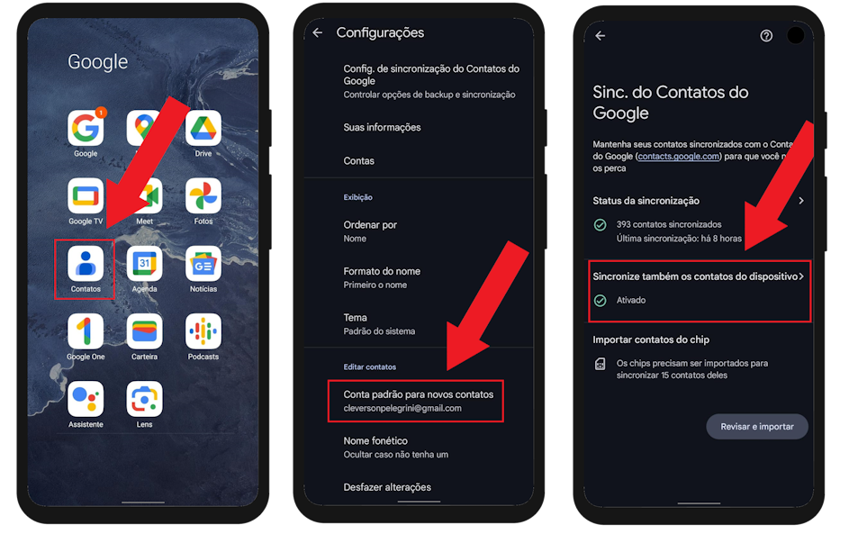
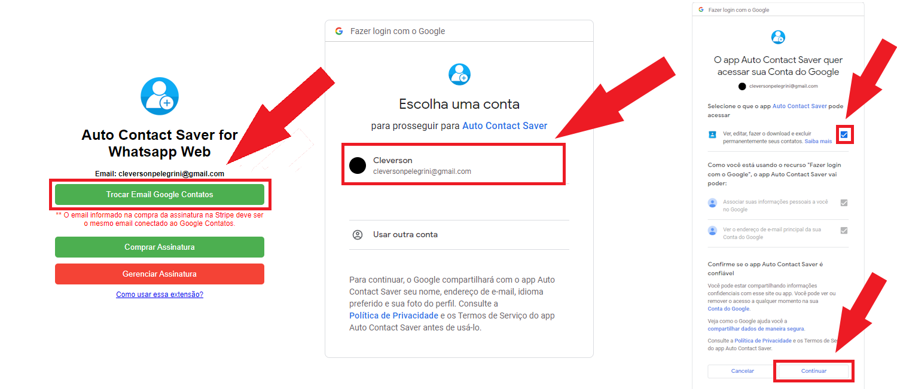
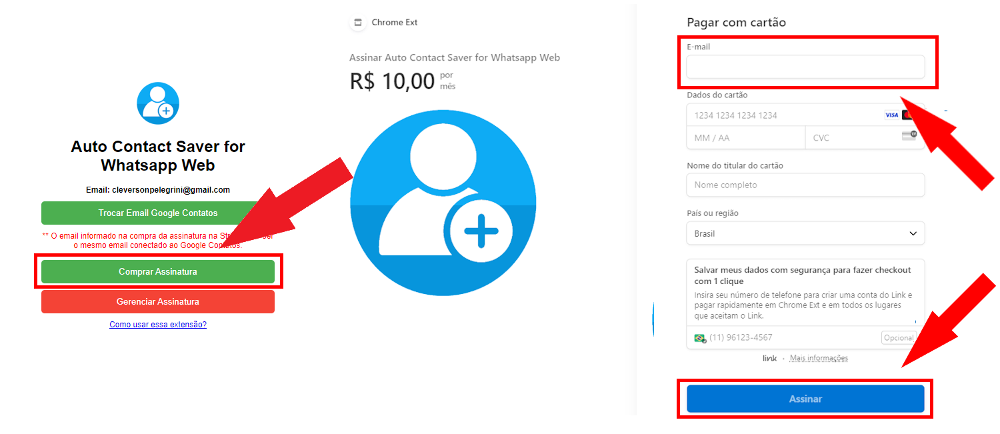
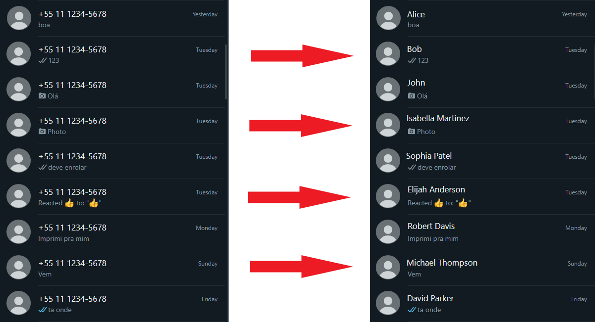

[Leia o site em português](portugues.md)

# Auto Contact Saver
Download now: [Auto Contact Saver for Whatsapp Web](https://chromewebstore.google.com/detail/auto-contact-saver-for-wh/nloadjiefippecgegockfpioobngphnb)

Subscribe now: [BRL$10.00 per month](https://buy.stripe.com/fZe7t9cl5dYqcnu7ss)

# Setup

## App

Check if the "Google Contacts" application is installed on your smartphone.

Check if the email connected to the app is the same email you will use in the extension.

Check if automatic contact synchronization is enabled in the app settings.

## Extension

Authorize the extension to write to your contacts.

Purchase a monthly subscription to activate the extension.

### The email provided upon payment must be the same email connected to your cell phone.

# How it works?

This extension automatically saves new contacts, there's no need to even leave the conversation window open.

When saving, an hourglass icon (⌛) will be at the end of the name, signaling that everything went well, and you only have to wait up to 5 minutes for Google to send the contact to your cell phone.

# Privacy Policy
**Auto Contact Saver for Whatsapp Web** use and transfer to any other app of information received from Google APIs will adhere to [Google API Services User Data Policy](https://developers.google.com/terms/api-services-user-data-policy), including the Limited Use requirements.

This extension just collects the name and phone number of your new Whatsapp contacts, and discards them entirely after sending them to Google's servers via People API.

This extension does not read, access, uses or share any data from your Google Contacts, it only writes.
