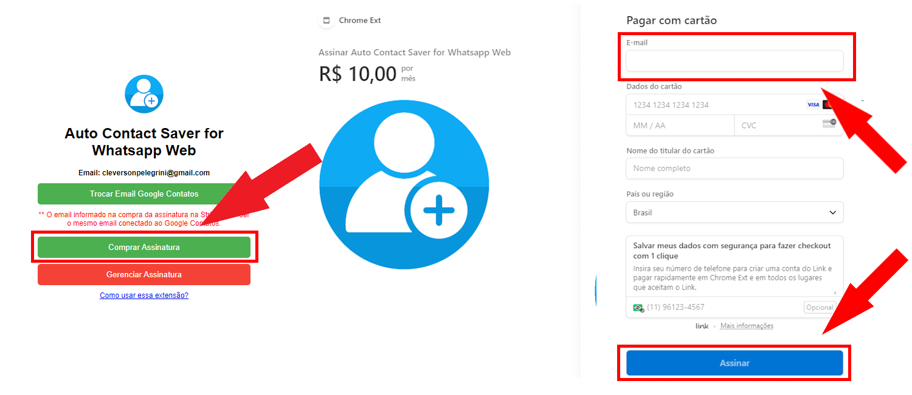
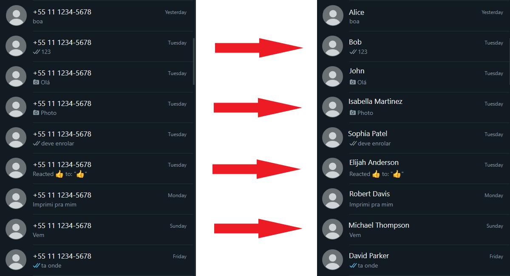

[Read the site in english](README.md)

<head>

</head>

# Auto Contact Saver
Baixe agora: [Auto Contact Saver for Whatsapp Web](https://chromewebstore.google.com/detail/auto-contact-saver-for-wh/nloadjiefippecgegockfpioobngphnb)

Assine agora: [R$10,00 por mês](https://buy.stripe.com/fZe7t9cl5dYqcnu7ss)

# Preparação

## App

Confira se o aplicativo "Google Contatos" está instalado no seu celular.

Confira se o email conectado no app é o mesmo email que você usará na extensão.

Confira se a sincronização automática de contatos está habilitata nas configurações do app.

## Extensão

Autorize a extensão a escrever nos seus contatos.

Compre uma assinatura mensal para ativar a extensão.

### O email fornecido no pagamento deve ser o mesmo email conectado no seu celular.

# O que a extensão faz?

Essa extensão salva automaticamente todos os seus contatos. Você também pode editar o nome dos contatos salvos de uma forma fácil.

Ao salvar, o contato estará imediatamente no seu [Google Contatos](https://contacts.google.com/), e só resta aguardar até 5 minutos para serem sincronizados com seu celular.

# Termos de Privacidade
O uso e transferência de informações recebidas das APIs do Google pelo **Auto Contact Saver for Whatsapp Web** obedecerção à [Política de dados do usuário dos serviços de API do Google](https://developers.google.com/terms/api-services-user-data-policy), incluindo os requisitos de uso limitado.

Esta extensão apenas coleta o nome e o número de telefone dos seus novos contatos do Whatsapp e os descarta totalmente após enviá-los aos servidores do Google por meio da People API.

Esta extensão não lê, acessa, usa ou compartilha nenhum dado dos seus Contatos do Google, apenas grava.